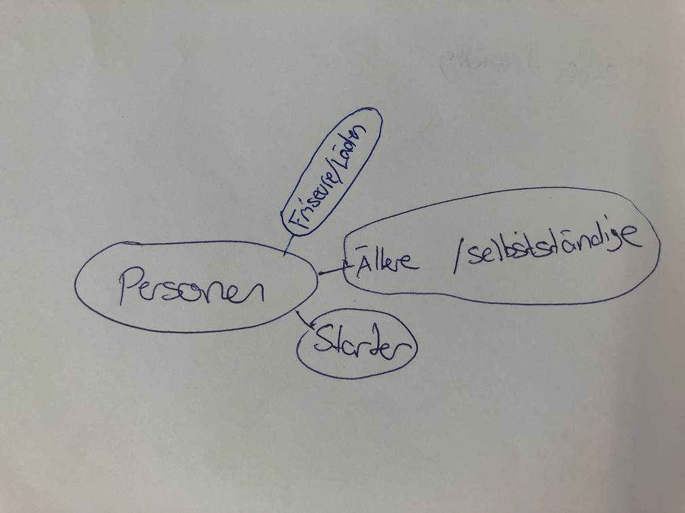
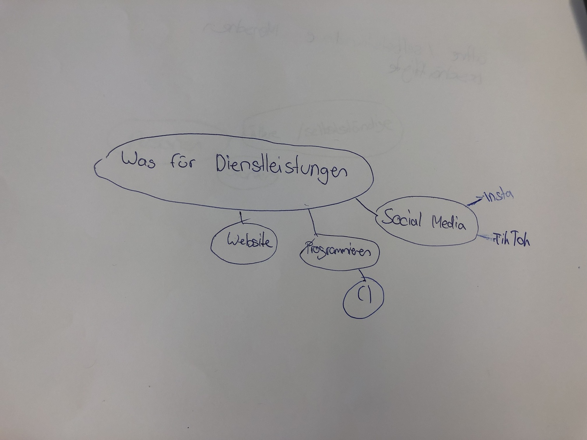

+++
title = "1. Nachmittag - Brainstorming"
date = "2021-08-31"
draft = false
pinned = false
+++
Als erstes ging es um Brainstorming - wir dachten darüber nach, aus welcher Zielgruppe unsere potenziellen Kunden stammen sollen. Dabei gibt es ein/zwei Punkte, die ziemlich trivial erscheinen, vor allem wenn es um den Umgang mit Computern geht - dazu später mehr. Es sind Menschen, eher älterer Generation, welche selbständig noch einen kleinen Quartierladen führen. Oder selbstständige, z.B. Friseure, denen schlichtweg die Zeit für einen ausgeklügelten Marketingplan fehlt. Bzw. die keine Social-Media Accounts/Webseiten haben. Dies kommt durchaus oft vor habe ich in meiner Recherche entdeckt.

Der zweite Punkt war herauszufinden, welche Dienstleistungen wir anbieten. Dabei gibt eine sehr breite Auswahl. Aber diejenigen auf welche wir uns begrenzt haben sind folgende (bzw. das Mind Map)

