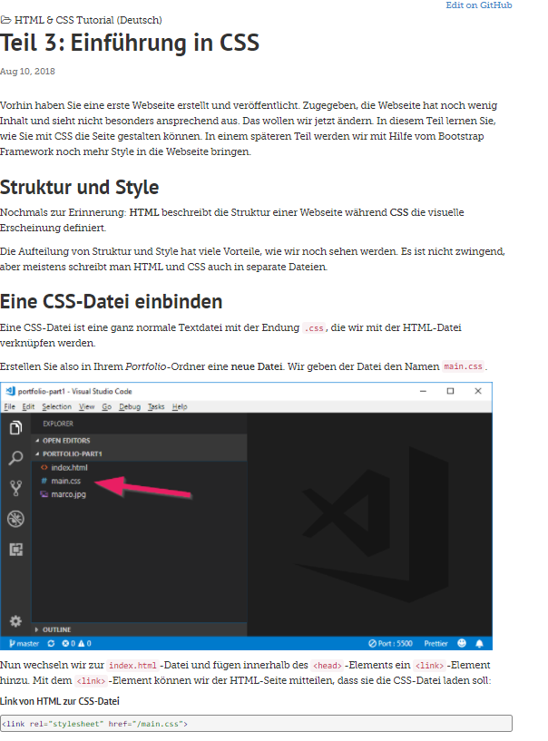
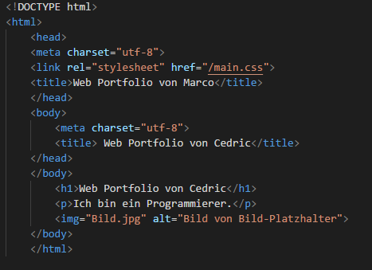

+++
title = "3./4. WEB Nachmittag - Programmieren und erster Entwurf des Projekts"
date = "2021-10-26"
draft = false
pinned = false
image = "ss-programmierung.png"
+++
Heute und letztes Mal haben wir uns mit den Grundlagen von HTML und CSS befasst und erste Entwürfe einer eigenen Mini-Webseite, siehe Titelbild.

Im Anhang ein paar Screenshots während meiner Arbeit an der Webseite auf Code-Makery. Derzeit bin ich am CSS am Arbeiten. Das ist dazu, der Seite einen eigenen Style zu bringen.

Der zweite Teil der Lektionen ging jeweils an die Projektarbeit, wo wir mit unserem Kunden letzten Dienstag das erste Meeting hatten. Folgendes steht bereits fest:

https://bwdbern.sharepoint.com/teams/WEB373/_layouts/15/Doc.aspx?OR=teams&action=edit&sourcedoc={75982CDA-960E-4352-849D-B067828B8388}

Derzeit sind wir an unserem Programm dran unsere Webseite zu grundieren. Oder mehr an folgendem zu arbeiten.

https://bwdbern.sharepoint.com/teams/WEB373/_layouts/15/Doc.aspx?OR=teams&action=edit&sourcedoc={700B738F-EF9A-42D8-BB16-99C13DEC4303}