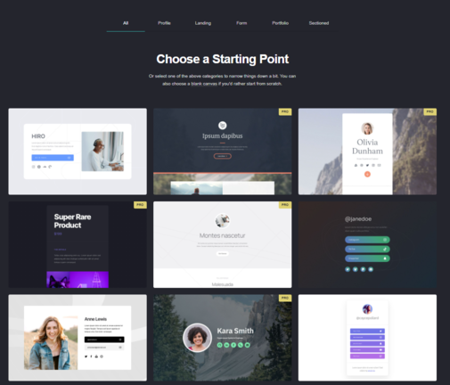

+++
title = "Blog Webseite Blumenladen"
date = "2021-08-24"
draft = false
pinned = false
image = "ssdsadsadsa-1-.png"
+++
In den ersten 4 WEB Lektionen hatten wir den Auftrag mit carrd.com eine Webseite für einen Blumenladen zu erstellen. Dabei wurde ziemlich schnell klar wie unkompliziert es sein kann eine Simple Webseite zu veröffentlichen. Nach den 1-2 Lektionen Arbeit, sah die Webseite so aus.

Damit das Endprodukt so aussehen kann, sind mehrere Schritte notwendig. Als erstes registriert man sich auf besagter Webseite. Nachher kann man ein "Grunddesign" wählen. Was dann etwa so aussieht:

Daraufhin kann man bereits sehr einfach die Webseite bearbeiten, in die Textfelder schreiben, die Buttons verlinken etc.