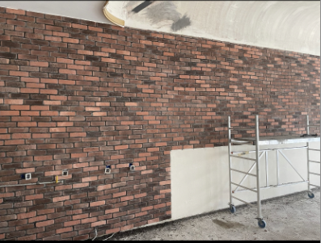

+++
title = "Fortsetzung Projekt"
date = "2021-11-16"
draft = false
pinned = false
image = "monitor-ge9b978578_640.jpg"
+++
# **Die Fotos und die Konstruktion des Internetauftritts**

Da wir uns vorgenommen haben einen kompletten Internetauftritt für unseren Kunden zu erstellen, fahren wir derzeit mehrgleisig. Unter Anderem machen wir Fotos, Social Media, Google Accounts. Wir bauen die Internetexistenz unseres Kunden von 0 auf 100 auf. 

Wir begannen mit einer ersten Fotosession, als wir unserem Kunden bei eins/zwei Dienstleistungen zugesehen haben. Zumal modernere Handys heutzutage mit sehr qualitativen Kameras ausgestattet sind, erübrigte es sich für uns professionelle Fotoapparate etc. zu organisieren. Dennoch haben wir sehr zufriedenstellende Fotos von der Arbeit unseres Kunden. Sprich, eine vorher/nachher Aufnahme, sowie Fotos des Kunden an der Arbeit. Diese Fotos sollen die Grundlage unseres Contents im Web sein. 

Diese Fotos und weitere sollen vor Allem auf unserer Webseite die Arbeit unseres Kunden veranschaulichen.

Wir haben die Webseite auf wix.com erstellt. In den nächsten Wochen wird noch eine genauere Darlegung folgen.

Dasselbe gilt auch dafür, dass wir einen Unternehmens-Account auf Google erstellen, damit unser Kunde einfach über Google gefunden werden kann. Zeitgleich gibt das auch eine geschäftliche E-Mail, welche mit dem Eintrag und der Webseite verknüpft ist. So soll in 2/3 Wochen, zumindest wenn man den Namen unseres Kunden auf Google sucht. unsere Webseite vorgeschlagen werden.

Des Weiteren ist ein Instagram-Account in Planung. Auch wenn uns bewusst ist, dass man nicht über Nacht an Tausende von Follower kommt, sollte man bedenken, dass jeder Abonnent ein zukünftiger Kunde sein kann. Insofern zählt jeder Follow. Dies soll ebenfalls ein Unternehmens-Account werden, den wir mit dem Google Konto verknüpfen, damit so ein kompletter und umfänglicher Internetauftritt zustande kommt.