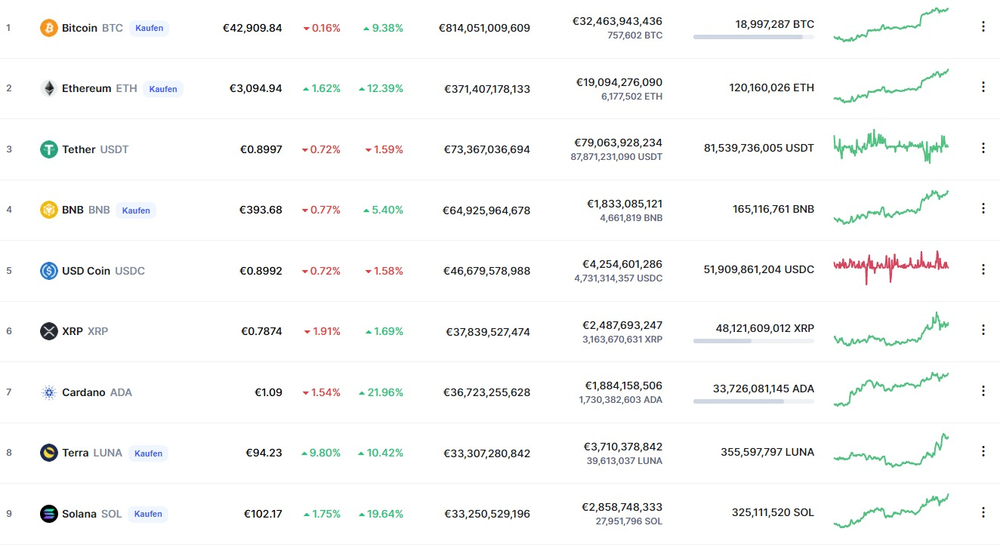

+++
title = "Handel mit Kryptowährungen"
date = "2022-03-29"
draft = false
pinned = false
image = "webaufnahme_3-5-2022_152556_www.shutterstock.com.jpeg"
+++
# **Einstieg in den Handel mit Kryptowährungen**

Viele Leute sehen die Kursentwicklung von Kryptowährungen wie Bitcoin oder Ethereum. Aus diesem Grund beginnen immer mehr Leute in Kryptos zu investieren. Somit entsteht ein grosses Marktwachstum. Dazu braucht man erstmal einen geeigneten Kryptowallet. Doch schon dabei gibt es allerlei Arten von Wallets.

Meine Dienstleistung wäre es, zu den jeweiligen Anbietern differenzierte Vergleiche anzubieten. Sowie Tipps und Informationen über den Handel mit Kryptowährungen bereitzustellen. Dazu biete ich einen relativ günstigen Newsletter an, in den all dies zu finden ist. Sowie immer aktuelle Informationen zu den verschiedenen Kryptowährungen.

#### Doch erstmal vorne weg, w**as sind eigentlich Kryptowährungen?**

Wie der Name es schon verrät ist es eine Währung, womit man verschiedene Dinge bezahlen kann. Das Kernmerkmal besagter Währung ist, dass es sogenannt dezentralisiert ist. Sprich, der Staat hat keinerlei direkten Einfluss auf die Wertentwicklung dieser Währung. Der Kurs der Währung lässt sich also ausschliesslich von Angebot und Nachfrage beeinflussen. 

Also kann grundsätzlich jeder eine solche Kryptowährung erstellen. Jedoch funktioniert eine Währung nur, wenn sie von entsprechend vielen Personen auch als Zahlungsmittel angesehen wird.

Wenn jemand einen gewissen Betrag als Kryptowährung kaufen will, muss ein anderer verkaufen. Alle Verkaufs- und Kaufangebote werden auf Grundlage einer \*Blockchain\* gehandelt, was heisst dass dort Angebot und Nachfrage aufeinander treffen. Folglich ist es so, dass wenn mehr Marktteilnehmer kaufen als verkaufen wollen, steigt der Kurs. Wenn mehr verkaufen wollen als kaufen, so sinkt er. 

Die bekanntesten Kryptowährungen sind Bitcoin und Ethereum. Es gibt jedoch noch unendlich viele andere Währungen, welche oft als Altcoins bezeichnet werden ; böse Zungen bezeichnen sie auch als "Shitcoins". Die Kurse der Altcoins schwanken täglich enorm. Es gibt nicht selten Kurse, die um 1000% steigen. Dies gilt aber vor allem für Kryptowährungen mit einem eher tiefen Preis pro Coin. Denn man darf nicht vergessen, diese Prozentangabe ist relativ. 

Unten, ein zwischenzeitliches Ranking der wertvollsten Kryptowährungen.

#### **\*Blockchain:**

Der Name Blockchain leitet sich von der Dokumentationsart der Daten ab, sprich Blöcke von Datensätzen werden aneinander gereiht und zu einer stetig wachsenden Blockchain verknüpft. Im Falle von Kryptowährungen, werden auf der Blockchain alle Transaktionen chronologisch aneinandergereiht. Der Inhalt einer Blockchain zu verändern ist quasi unmöglich. Eine Blockchain wird quasi als ein verteiltes Register geführt. Alle Beteiligten speichern sozusagen eine Kopie und führen diese fort.

### **1. Vor dem Investment ; Die Krypto-Wallet**

Um eine Kryptowährung kaufen zu können braucht man eine Wallet (engl. für Brieftasche). Hierbei kann man zwischen Cold Wallet und Hot Wallet unterscheiden. Diese beiden Arten von Wallets unterscheiden sich im Bezug auf den Sicherheitsstandard, sowie bei der Nutzerfreundlichkeit und weiteren anderen Punkten. Dadurch sind sie für verschiedene Anlegertypen je nachdem mehr, oder weniger geeignet. Zum einen gibt es Kryptobörsen, die wahrscheinlich bekanntesten Beispiele sind Binance und Coinbase. Sobald man sich auf einer solchen registriert, wird automatisch eine Hot-Wallet erstellt. \
Die andere Option ist eben eine Cold Wallet, diese kann man online erwerben. Es ist eine Art Festplatte, es dient als analoges, externes Speichermedium. Es kann sehr einfach im Internet erworben werden. 

### **Hot-Wallet:**

+hohe Nutzerfreundlichkeit + Kundensupport

+Geeignet für kurzfristige Anlagen, da man sehr einfach auf Tagesgeschehen reagieren kann und das kaufen bzw. verkaufen bzw. in andere Währungen gewechselt werden.

–  Dadurch, dass es Online ist, ist die Gefahr von Hackangriffen allgegenwärtig.

### **Cold-Wallet:**

+Sehr minimierte Hacking-Gefahr

+Für langfristige Anlage

–  Nicht sehr anfängerfreundlich 

– Weniger geeignet für schnelle Käufe, Verkäufe oder Tauschgeschäfte.

Fürs erste würde ich einen Hot-Wallet auf einer dezentralisierten Seite empfehlen. Wie man erahnen kann gibt es quasi unendliche Wallet-Anbieter, da es ein wachsender und lukrativer Markt ist. Man muss allerdings immer bedenken, dass Anbieter auch profitieren. So also gibt es z.B. bei Ethereum sogenannte "Gaz-fees", was zugleich die Gewinnmarche des Anbieters darstellt. In der Regel ist es nicht unendlich viel, aber das variiert auch von Währung zu Währung und von Anbieter zu Anbieter und lässt sich mit entsprechender Expertise auch etwas dezimieren.

Die wahrscheinlich beliebtesten Hot-Wallets sind bitpanda, crypto.com und vor allem Coinbase und Binance. Hier gilt allerdings Vorsicht bei der Auswahl. Es gibt ein sehr breitflächiges Angebot, Beispielsweise kann man von  Binance Kryptos quasi kostenfrei zu MetaMask transferieren, MetaMask wiederum funktioniert gut mit OpenSea, wo man vor allem NFTs (Non-Fungible-Tokens) kaufen kann. Es gibt viele solcher Beispiele und darüber sollte man den Überblick behalten. 

Sollte man jedoch nur mit Kryptowährungen handeln wollen, kann man sich auch kurzerhand entscheiden. Für den reinen Kryptohandel benutze ich Binance, für Neueinsteiger empfehle ich jedoch mit Coinbase zu starten, zumal das Registrationsverfahren relativ einfach ist und man bereits ab CHF 15.- investieren kann.

Gerne weise ich hierbei auf meinen Newsletter hin, dort findet man eine detaillierte Übersicht dieser Wallet-Anbieter.

Nun müssen wir uns vor der Investition nur noch informieren. Das ist aber der schwierigste und wichtigste Schritt beim Handel. Kryptos haben eine sehr starke Volatilität, sprich sie schwanken sehr stark. Man kann vom einen Tag auf den anderen Sehr viel gewinnen oder auch verlieren. Das heisst, es ist immer mit ordentlichem Risiko verbunden.

###### Um das Risiko ein wenig zu minimieren, habe ich einige **Wichtige Tipps** zusammengestellt

* Kaufe ausschliesslich, wenn du verstehst, weswegen ein Coin wertvoll sein soll bzw. Potenzial hat.
* Denk an die Gebühren beim Kaufen, es ist schwieriger Profit zu holen, als Verlust. Am besten man benutzt ETH für die Transaktion, dabei sind die Gebühren eher tief.
* Investiere nie mehr als du bereit bist zu verlieren und leih dir sowieso nicht Geld von anderen um zu Investieren.
* Verhindere das Eintreffen des FOMO-Syndroms (Fear Of Missing Out)
* Das wichtigste: Werde nicht nervös und halte die Währung. Der grösste Fehler eines Traders ist "Panicselling"
* Informiere dich auf vertrauenswürdigen Quellen, nicht dass du Opfer eines Insiderhandels o. Ä. wirst. Vor allem auf den sozialen Medien rate ich zu maximaler Vorsicht.
* Wenn du Zweifel betreffend dem Zeitpunkt hast, benutze den Cost Averaging Effect*-> Deutsch: Durchschnittskosteneffekt. 

  Kurzes Beispiel mit XRP*:

  Du willst 1 XRP kaufen, aber bist dir nicht sicher ob es der passende Zeitpunkt ist, also kaufst du 10 Wochen lang regelmässig 0.1 XRP, folglich zu verschiedenen Preisen, dann hast du für 1 XRP den Durchschnittspreis der letzten 10 Wochen bezahlt.

### Gerne verweise ich abermals auf meinen Newsletter, welcher folgendes beinhaltet:

* Allgemeine Infos zur Kryptobranche
* Steckbriefe und Aktuelle Informationen zu einzelnen Coins
* Hilfe bei der Wahl einer Wallet
* 50+ wichtige Grundlagentipps im Handel mit Kryptos
* DOT und das Web 3.0 sowie andere aktuelle Themen 
* Kryptos mit Potenzial
* Persönliche Erfahrungen und Einschätzungen

Bei Interesse an meinen Dienstleistungen bzw. dem Newsletter, schreiben Sie mir eine E-Mail auf: cedric.ogg04@gmail.com